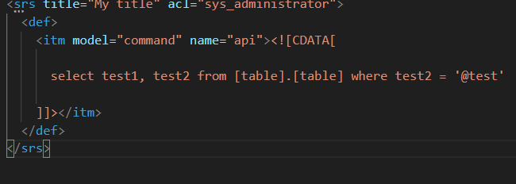
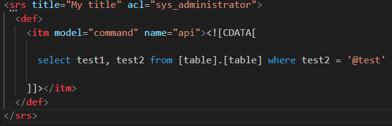

# CDATA-SQL-HIGHLIGHTER

This extension provides syntax highlighting for SQL code embedded within CDATA tags in XML files. It enhances the readability of your code and streamlines your workflow by providing dedicated highlighting for SQL code within CDATA tags.

## Features

- Syntax highlighting for SQL code within CDATA tags in XML files.
- Dedicated highlighting for SQL keywords, functions, and operators.
- Improved readability and code navigation for SQL code within CDATA tags.

## Screenshots

before:

after:

